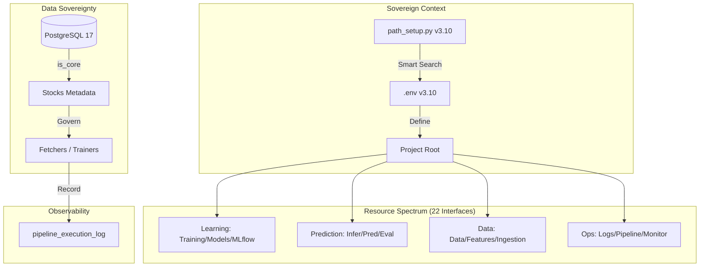

# Quantum Finance v5.2 全域治理架構 (Sovereign Infrastructure) 報告

## 1. 執行摘要 (Executive Summary)
在 Quantum Finance v5.2 架構中，系統實現了「資料庫主權化」與「全頻譜路徑治理」。這不僅解決了路徑碎裂化問題，更將 22 個關鍵資源維度納入統一調度中心。透過 `path_setup.py v3.10` 的全域感知能力，系統具備了在異構環境下（WSL2, Docker, Prod VM）自動定錨並自我修復的能力。

---

## 2. 核心架構突破 (Status: v3.10 Sovereign Edition)

目前的治理體系已達成以下「生產級」技術標準：

### 2.1 全頻譜路徑治理 (22-Dimension Governance)
系統精確定義並管理 22 個關鍵接口，涵蓋從數據採集 (Ingestion) 到模型學習 (Training)、推論 (Inference) 與預測產出 (Prediction) 的全生命週期。
*   **學習層 (Learning Layer)**：統一管理 `TRAINING_DIR` 與 `MODEL_DIR`，解決了訓練腳本與權重存放的混亂。
*   **預測層 (Prediction Layer)**：明確區分 `INFER_DIR` (邏輯) 與 `PREDICTION_DIR` (數據)，達成動態與靜態資源分離。

### 2.2 全域環境感知 (Global Context Aware)
採用「向上追蹤法」自動偵測 `.env` 與專案根目錄 (`PROJECT_ROOT`)。
*   **動態適應性**：無論開發者在專案的哪個層級執行程式，系統均能自動鎖定正確的環境配置。
*   **配置外部化**：所有資源位置皆可透過 `.env` 快速重導向（例如將 `DATA_DIR` 指向外部高速 SSD），達成邏輯與存儲的解耦。

### 2.3 資料庫主權化 (Database Sovereignty)
資產清單與元數據已從代碼 (`config.py`) 永久遷移至資料庫 `stocks` 表格。
*   **單一真理來源**：標的之產業、名稱、連動關係皆由資料庫主導，達成「數據驅動 (Data-Driven)」的動態管理。

### 2.4 混合模式觀測 (Hybrid Observability)
資源調度行為已全面接入 `pipeline_execution_log`。
*   **生命週期追蹤**：每一次路徑審計或自癒行為均有計時紀錄，確保基礎設施層面的透明度。

---

## 3. 全域資源映射表 (Sovereign Map)

| 維度 (Dimension) | 變數名稱 | 實體路徑範例 | 治理功能 |
| :--- | :--- | :--- | :--- |
| **數據層** | `DATA_DIR` | `/data` | 原始數據存儲 |
| **特徵層** | `FEATURE_DIR` | `/features` | 特徵工程快取 |
| **模型層** | `MODEL_DIR` | `/models` | 模型權重註冊中心 |
| **訓練層** | `TRAINING_DIR` | `/scripts/training` | 模型學習邏輯 |
| **預測層** | `PREDICTION_DIR` | `/predictions` | 最終預測結果 |
| **日誌層** | `LOG_DIR` | `/logs" | 系統運行稽核 |

---

## 4. 技術架構圖 (Mermaid v5.2)

---

## 5. 結論與後續規劃
Quantum Finance 系統已完成「基礎設施治理階段 (Governance Regime)」，系統穩定性大幅提升。
**下一階段目標**：
1.  **DVC 數據版本化**：利用現有的 `ARCHIVE_DIR` 接口，實現數據與模型的精確回溯。
2.  **分布式採集監控**：利用 `MONITOR_DIR` 與資料庫審計，達成自動化數據斷層偵測與癒合。

---
**報告簽署**：Antigravity 量化架構團隊
**日期**：2026-05-11
