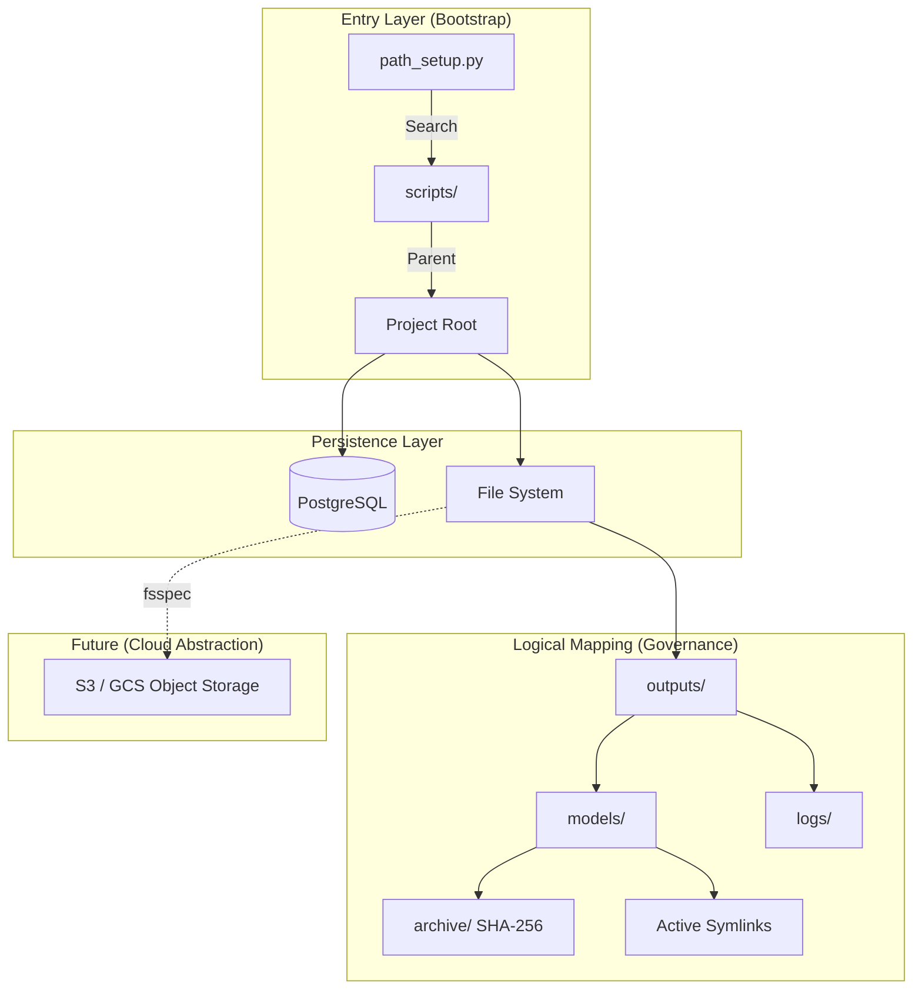

# Quantum Finance v5.1 系統路徑架構 (Path Governance) 深度研究報告

## 1. 執行摘要 (Executive Summary)
在 Quantum Finance v5.1 物理資訊系統中，數據與模型的存放位置不僅是「檔案路徑」，更是系統狀態的「座標系統」。`path_setup.py` 扮演著系統定錨點 (Anchor) 的角色，負責在高度動態且異構的執行環境中（本地開發、多進程訓練、Docker 容器、雲端虛擬機）確保代碼邏輯與實體資產的絕對對齊。本報告旨在分析現有架構優勢，並規劃通往「數據即代碼 (Data-as-Code)」的演進路徑。

---

## 2. 現有架構剖析 (Current Status: v2.2 Integrity Edition)

目前的 `path_setup.py` 已達成以下核心技術標準：

### 2.1 遞迴自癒啟動 (Recursive Bootstrap)
系統不依賴硬編碼的絕對路徑，而是透過 `__file__` 向上溯源尋找 `scripts` 標記目錄。這使得專案在不同使用者路徑（如 `/home/hugo/` 或 `/root/`）下均能零配置執行。

### 2.2 實體完整性守護 (Physical Integrity)
透過 `ensure_dirs_exist()`，系統具備「啟動即復原」的能力。若 `outputs/models` 被誤刪，系統會在執行首毫秒自動重建目錄結構，防止後續 I/O 操作引發 `FileNotFoundError`。

### 2.3 命名空間自癒 (Namespace Healing)
針對 `from core.xxx` 在直接執行時會報 `ModuleNotFoundError` 的 Python 特性，v2.2 導入了雙層 `sys.path` 注入機制，確保 `core` 與 `scripts` 同時具備包裝 (Package) 與腳本 (Script) 的雙重特性。

---

## 3. 未來演進建議 (Architectural Roadmap)

隨著系統規模擴張至 150+ 核心資產與 TB 級數據，建議朝以下三個維度進行架構升級：

### 階段一：配置驅動與安全性強化 (Regime: Secure Orchestration)
*   **配置外部化**：將預設路徑（如 `outputs/`）遷移至 `.env` 或 `config.yaml`。允許開發者在啟動時透過 `export DATA_ROOT=/mnt/fast_ssd` 快速切換存儲介質，而無需修改程式碼。
*   **路徑沙箱化 (Sandboxing)**：實作 `SafePath` 封裝，防止惡意的目錄遍歷 (Path Traversal)，確保系統不會在寫入模型時意外覆蓋系統關鍵檔案。

### 階段二：雲端原生與虛擬檔案系統 (Regime: Cloud Native)
*   **FSSpec 整合**：導入 `fsspec` 抽象層。未來的 `get_models_dir()` 將不僅回傳本地路徑，還能支援 `s3://quantum-models/v5.1/` 或 `gcs://...`。
*   **對接 DVC (Data Version Control)**：將 `path_setup` 與 DVC 集成。當代碼切換至 Git 分支 `feature/new-factor` 時，`path_setup` 能自動偵測並確保所需的特徵快取已就緒。

### 階段三：符號鏈接註冊與數據治理 (Regime: Governance)
*   **數位孿生路徑 (Digital Twin Paths)**：為每個 `stock_id` 建立符號鏈接 (Symlinks)。例如 `outputs/active_models/2330.pkl` 永遠指向最新的生產模型，而實際檔案則存放在帶有時間戳的 `archive/` 中。這能簡化推論管線的讀取邏輯。
*   **自動清理機制 (LRU Purge)**：在 `path_setup` 中加入磁碟配額管理。當 `logs/` 或 `checkpoints/` 超過 50GB 時，自動清理最舊的非核心數據，確保高頻訓練不因磁碟溢出而中斷。

---

## 4. 技術架構建議圖 (Mermaid)

---

## 5. 結論
`path_setup.py` 不應僅被視為一個輔助腳本，它是整個 Quantum Finance 生態系的「空間基準」。透過 v2.2 的實體自癒能力，系統已具備極高的魯棒性。未來若能朝向 **「配置外部化」** 與 **「存儲抽象化」** 進化，將能支撐起更大規模的分散式量化運算需求。

---
**報告簽署**：Antigravity 量化系統架構組
**日期**：2026-05-10
